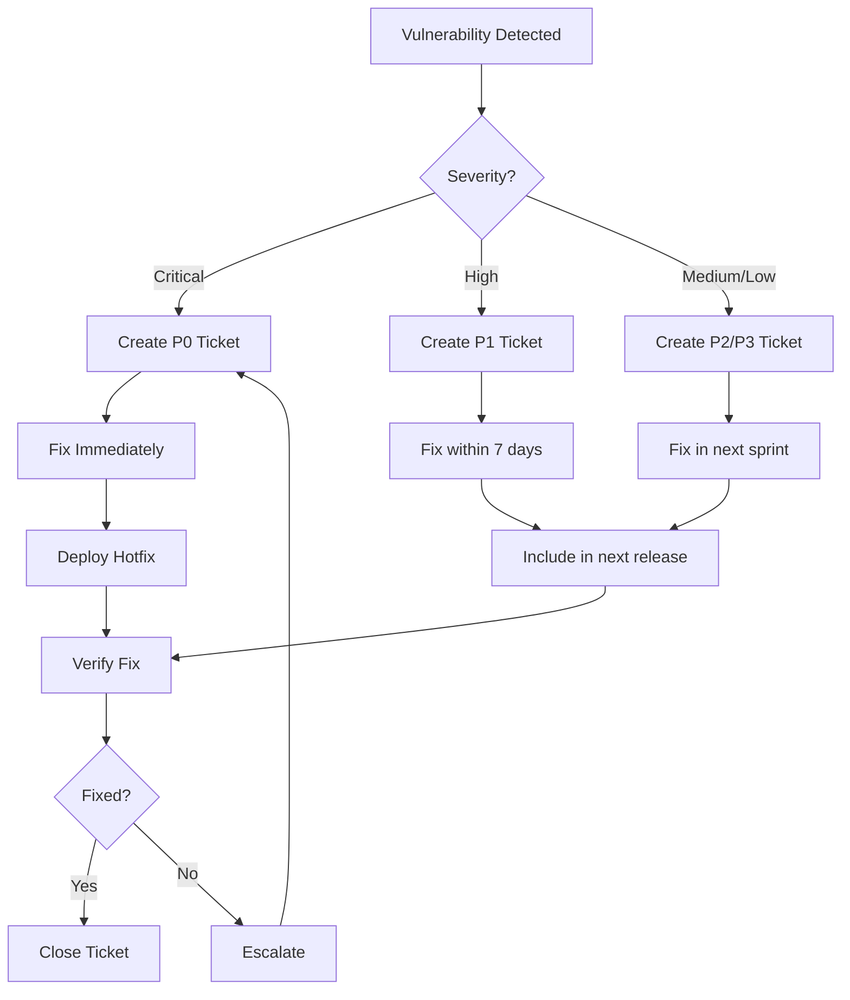

# Building Your First Security Pipeline

## Learning Objectives

By the end of this chapter, you will:
- Build a complete security pipeline from scratch
- Integrate security tools into CI/CD workflows
- Implement security gates and policies
- Automate security testing with GitHub Actions and Jenkins
- Handle security findings and vulnerabilities
- Monitor and improve pipeline security over time

---

## What is a Security Pipeline?

A **security pipeline** is an automated workflow that integrates security testing, scanning, and validation into your CI/CD process. It enables "shift-left" security by catching vulnerabilities early.

### Traditional vs Security Pipeline

**Traditional Pipeline**:
```
Code → Build → Test → Deploy → (Security finds issues) → Fix → Redeploy
```

**Security Pipeline**:
```
Code → Security Scan → Build → Security Test → Deploy → Monitor
         ↓               ↓            ↓
    (Fix issues)   (Fix issues)  (Fix issues)
```

---

## Security Pipeline Components

### Essential Security Checks

```yaml
Security Pipeline Stages:
  1. Pre-commit:
     - Git hooks for secrets
     - Local security linting
  
  2. Source Analysis (SAST):
     - Static code analysis
     - Security code review
     - Coding standards check
  
  3. Dependency Scanning (SCA):
     - Vulnerable dependency detection
     - License compliance check
     - Supply chain security
  
  4. Build Security:
     - Container image scanning
     - IaC security analysis
     - Artifact signing
  
  5. Dynamic Testing (DAST):
     - Runtime vulnerability scan
     - Penetration testing
     - API security testing
  
  6. Deployment Gates:
     - Security approval required
     - Compliance verification
     - Policy enforcement
  
  7. Production Monitoring:
     - Runtime security
     - Threat detection
     - Incident response
```

---

## Part 1: GitHub Actions Security Pipeline

### Complete GitHub Actions Workflow

```yaml
# .github/workflows/security-pipeline.yml
name: Security Pipeline

on:
  push:
    branches: [main, develop]
  pull_request:
    branches: [main]
  schedule:
    # Run security scans daily at 2 AM
    - cron: '0 2 * * *'

env:
  DOCKER_IMAGE: myapp
  SEVERITY_THRESHOLD: HIGH

jobs:
  # Job 1: Secret Scanning
  secrets-scan:
    name: Secret Detection
    runs-on: ubuntu-latest
    steps:
      - name: Checkout code
        uses: actions/checkout@v3
        with:
          fetch-depth: 0  # Full history for better detection
      
      - name: Gitleaks Scan
        uses: gitleaks/gitleaks-action@v2
        env:
          GITHUB_TOKEN: ${{ secrets.GITHUB_TOKEN }}
          GITLEAKS_LICENSE: ${{ secrets.GITLEAKS_LICENSE }}
      
      - name: TruffleHog Scan
        uses: trufflesecurity/trufflehog@main
        with:
          path: ./
          base: main
          head: HEAD
          extra_args: --debug --only-verified

  # Job 2: Static Code Analysis (SAST)
  sast:
    name: Static Application Security Testing
    runs-on: ubuntu-latest
    steps:
      - name: Checkout code
        uses: actions/checkout@v3
      
      - name: Run Semgrep
        uses: returntocorp/semgrep-action@v1
        with:
          config: >-
            p/security-audit
            p/secrets
            p/owasp-top-ten
            p/sql-injection
            p/xss
        env:
          SEMGREP_RULES: auto
      
      - name: SonarCloud Scan
        uses: SonarSource/sonarcloud-github-action@master
        env:
          GITHUB_TOKEN: ${{ secrets.GITHUB_TOKEN }}
          SONAR_TOKEN: ${{ secrets.SONAR_TOKEN }}
        with:
          args: >
            -Dsonar.projectKey=myapp
            -Dsonar.organization=myorg
            -Dsonar.security.hotspots=HIGH
      
      - name: Upload SAST Results
        uses: actions/upload-artifact@v3
        if: always()
        with:
          name: sast-results
          path: semgrep-results.json

  # Job 3: Dependency Scanning (SCA)
  dependency-scan:
    name: Software Composition Analysis
    runs-on: ubuntu-latest
    steps:
      - name: Checkout code
        uses: actions/checkout@v3
      
      - name: Set up Node.js
        uses: actions/setup-node@v3
        with:
          node-version: '18'
      
      - name: Install dependencies
        run: npm ci
      
      - name: NPM Audit
        run: |
          npm audit --audit-level=high --json > npm-audit.json || true
          cat npm-audit.json
      
      - name: Snyk Scan
        uses: snyk/actions/node@master
        continue-on-error: true
        env:
          SNYK_TOKEN: ${{ secrets.SNYK_TOKEN }}
        with:
          args: --severity-threshold=high --json-file-output=snyk-results.json
      
      - name: OWASP Dependency-Check
        uses: dependency-check/Dependency-Check_Action@main
        with:
          project: 'myapp'
          path: '.'
          format: 'JSON'
          args: >
            --enableRetired
            --failOnCVSS 7
      
      - name: Upload Dependency Results
        uses: actions/upload-artifact@v3
        if: always()
        with:
          name: dependency-results
          path: |
            npm-audit.json
            snyk-results.json
            dependency-check-report.json

  # Job 4: Container Security
  container-scan:
    name: Container Image Scanning
    runs-on: ubuntu-latest
    needs: [sast, dependency-scan]
    steps:
      - name: Checkout code
        uses: actions/checkout@v3
      
      - name: Build Docker image
        run: |
          docker build -t ${{ env.DOCKER_IMAGE }}:${{ github.sha }} .
      
      - name: Trivy Vulnerability Scan
        uses: aquasecurity/trivy-action@master
        with:
          image-ref: ${{ env.DOCKER_IMAGE }}:${{ github.sha }}
          format: 'json'
          output: 'trivy-results.json'
          severity: 'CRITICAL,HIGH'
          exit-code: '1'  # Fail on findings
      
      - name: Grype Scan
        uses: anchore/scan-action@v3
        with:
          image: ${{ env.DOCKER_IMAGE }}:${{ github.sha }}
          fail-build: true
          severity-cutoff: high
      
      - name: Docker Scout CVE Scan
        uses: docker/scout-action@v1
        with:
          command: cves
          image: ${{ env.DOCKER_IMAGE }}:${{ github.sha }}
          only-severities: critical,high
          exit-code: true
      
      - name: Upload Container Results
        uses: actions/upload-artifact@v3
        if: always()
        with:
          name: container-results
          path: trivy-results.json

  # Job 5: IaC Security
  iac-scan:
    name: Infrastructure as Code Security
    runs-on: ubuntu-latest
    steps:
      - name: Checkout code
        uses: actions/checkout@v3
      
      - name: Checkov Scan
        uses: bridgecrewio/checkov-action@master
        with:
          directory: .
          framework: terraform,dockerfile,kubernetes
          soft_fail: false
          output_format: json
          output_file_path: checkov-results.json
      
      - name: tfsec Scan
        uses: aquasecurity/tfsec-action@v1.0.0
        with:
          working_directory: terraform/
          soft_fail: false
      
      - name: KICS Scan
        uses: checkmarx/kics-github-action@v1.7
        with:
          path: '.'
          fail_on: high
          output_path: kics-results.json
      
      - name: Upload IaC Results
        uses: actions/upload-artifact@v3
        if: always()
        with:
          name: iac-results
          path: |
            checkov-results.json
            kics-results.json

  # Job 6: Security Unit Tests
  security-tests:
    name: Security Unit Tests
    runs-on: ubuntu-latest
    steps:
      - name: Checkout code
        uses: actions/checkout@v3
      
      - name: Set up Python
        uses: actions/setup-python@v4
        with:
          python-version: '3.11'
      
      - name: Install dependencies
        run: |
          pip install -r requirements.txt
          pip install pytest pytest-cov
      
      - name: Run Security Tests
        run: |
          pytest tests/security/ -v \
            --cov=app \
            --cov-report=xml \
            --cov-report=html \
            --junitxml=test-results.xml
      
      - name: Upload Test Results
        uses: actions/upload-artifact@v3
        if: always()
        with:
          name: security-test-results
          path: |
            test-results.xml
            coverage.xml

  # Job 7: Dynamic Security Testing (DAST)
  dast:
    name: Dynamic Application Security Testing
    runs-on: ubuntu-latest
    needs: [container-scan]
    if: github.ref == 'refs/heads/main'
    steps:
      - name: Checkout code
        uses: actions/checkout@v3
      
      - name: Start Application
        run: |
          docker-compose up -d
          sleep 30  # Wait for app to be ready
      
      - name: OWASP ZAP Baseline Scan
        uses: zaproxy/action-baseline@v0.7.0
        with:
          target: 'http://localhost:3000'
          rules_file_name: '.zap/rules.tsv'
          cmd_options: '-a -j'
      
      - name: OWASP ZAP Full Scan
        uses: zaproxy/action-full-scan@v0.4.0
        if: github.event_name == 'schedule'
        with:
          target: 'http://localhost:3000'
          allow_issue_writing: false
      
      - name: Nuclei Scan
        uses: projectdiscovery/nuclei-action@main
        with:
          target: 'http://localhost:3000'
          templates: 'cves,vulnerabilities,exposures'
      
      - name: Upload DAST Results
        uses: actions/upload-artifact@v3
        if: always()
        with:
          name: dast-results
          path: |
            zap-report.html
            nuclei-results.json

  # Job 8: Security Gate
  security-gate:
    name: Security Gate & Reporting
    runs-on: ubuntu-latest
    needs: [secrets-scan, sast, dependency-scan, container-scan, iac-scan, security-tests]
    if: always()
    steps:
      - name: Download All Results
        uses: actions/download-artifact@v3
      
      - name: Aggregate Security Results
        run: |
          python scripts/aggregate-security-results.py \
            --output security-report.html
      
      - name: Check Security Thresholds
        run: |
          python scripts/security-gate-check.py \
            --max-critical 0 \
            --max-high 5 \
            --max-medium 20
      
      - name: Upload Security Report
        uses: actions/upload-artifact@v3
        with:
          name: security-report
          path: security-report.html
      
      - name: Comment PR with Results
        if: github.event_name == 'pull_request'
        uses: actions/github-script@v6
        with:
          script: |
            const fs = require('fs');
            const report = fs.readFileSync('security-report.html', 'utf8');
            github.rest.issues.createComment({
              issue_number: context.issue.number,
              owner: context.repo.owner,
              repo: context.repo.repo,
              body: `## 🔒 Security Scan Results\n\n${report}`
            });
      
      - name: Notify on Failure
        if: failure()
        uses: 8398a7/action-slack@v3
        with:
          status: ${{ job.status }}
          text: 'Security pipeline failed! Critical vulnerabilities detected.'
          webhook_url: ${{ secrets.SLACK_WEBHOOK }}

  # Job 9: Deploy (Only after security checks pass)
  deploy:
    name: Deploy to Staging
    runs-on: ubuntu-latest
    needs: [security-gate]
    if: github.ref == 'refs/heads/main'
    environment:
      name: staging
      url: https://staging.example.com
    steps:
      - name: Deploy Application
        run: |
          echo "Deploying to staging..."
          # Your deployment commands here
      
      - name: Post-Deployment Security Check
        run: |
          # Verify security configurations
          curl -f https://staging.example.com/health
```

---

## Part 2: Jenkins Security Pipeline

### Jenkinsfile with Security Integration

```groovy
// Jenkinsfile
pipeline {
    agent any
    
    environment {
        DOCKER_IMAGE = 'myapp'
        DOCKER_TAG = "${env.BUILD_NUMBER}"
        SEVERITY_THRESHOLD = 'HIGH'
    }
    
    options {
        buildDiscarder(logRotator(numToKeepStr: '10'))
        timeout(time: 1, unit: 'HOURS')
        timestamps()
    }
    
    stages {
        stage('Checkout') {
            steps {
                checkout scm
                sh 'git fetch --all --tags'
            }
        }
        
        stage('Secret Scanning') {
            parallel {
                stage('Gitleaks') {
                    steps {
                        script {
                            sh '''
                                docker run --rm -v $(pwd):/code \
                                  zricethezav/gitleaks:latest \
                                  detect --source="/code" \
                                  --report-path="/code/gitleaks-report.json" \
                                  --exit-code=1
                            '''
                        }
                    }
                }
                
                stage('TruffleHog') {
                    steps {
                        sh '''
                            docker run --rm -v $(pwd):/code \
                              trufflesecurity/trufflehog:latest \
                              filesystem /code --json > trufflehog-results.json
                        '''
                    }
                }
            }
            post {
                always {
                    archiveArtifacts artifacts: '*-results.json', allowEmptyArchive: true
                }
            }
        }
        
        stage('SAST') {
            parallel {
                stage('Semgrep') {
                    steps {
                        sh '''
                            docker run --rm -v $(pwd):/src \
                              returntocorp/semgrep \
                              semgrep --config=auto --json \
                              --output=/src/semgrep-results.json /src
                        '''
                    }
                }
                
                stage('SonarQube') {
                    steps {
                        script {
                            def scannerHome = tool 'SonarScanner'
                            withSonarQubeEnv('SonarQube') {
                                sh """
                                    ${scannerHome}/bin/sonar-scanner \
                                      -Dsonar.projectKey=myapp \
                                      -Dsonar.sources=. \
                                      -Dsonar.host.url=${SONAR_HOST_URL} \
                                      -Dsonar.login=${SONAR_AUTH_TOKEN}
                                """
                            }
                        }
                    }
                }
            }
            post {
                always {
                    archiveArtifacts artifacts: 'semgrep-results.json', allowEmptyArchive: true
                }
            }
        }
        
        stage('Quality Gate') {
            steps {
                timeout(time: 5, unit: 'MINUTES') {
                    waitForQualityGate abortPipeline: true
                }
            }
        }
        
        stage('Dependency Scan') {
            parallel {
                stage('NPM Audit') {
                    steps {
                        sh '''
                            npm audit --json > npm-audit.json || true
                            npm audit --audit-level=high
                        '''
                    }
                }
                
                stage('Snyk') {
                    steps {
                        script {
                            snykSecurity(
                                snykInstallation: 'Snyk',
                                snykTokenId: 'snyk-api-token',
                                failOnIssues: true,
                                severity: 'high'
                            )
                        }
                    }
                }
                
                stage('OWASP Dependency-Check') {
                    steps {
                        dependencyCheck additionalArguments: '''
                            --scan .
                            --format JSON
                            --format HTML
                            --failOnCVSS 7
                            --enableRetired
                        ''', odcInstallation: 'dependency-check'
                        
                        dependencyCheckPublisher pattern: 'dependency-check-report.json'
                    }
                }
            }
            post {
                always {
                    archiveArtifacts artifacts: '*audit*.json, dependency-check-*', allowEmptyArchive: true
                }
            }
        }
        
        stage('Build') {
            steps {
                sh '''
                    docker build \
                      -t ${DOCKER_IMAGE}:${DOCKER_TAG} \
                      -t ${DOCKER_IMAGE}:latest \
                      --build-arg BUILD_DATE=$(date -u +'%Y-%m-%dT%H:%M:%SZ') \
                      --build-arg VCS_REF=$(git rev-parse --short HEAD) \
                      .
                '''
            }
        }
        
        stage('Container Scan') {
            parallel {
                stage('Trivy') {
                    steps {
                        sh '''
                            docker run --rm \
                              -v /var/run/docker.sock:/var/run/docker.sock \
                              aquasec/trivy:latest \
                              image --severity CRITICAL,HIGH \
                              --exit-code 1 \
                              --format json \
                              --output trivy-results.json \
                              ${DOCKER_IMAGE}:${DOCKER_TAG}
                        '''
                    }
                }
                
                stage('Grype') {
                    steps {
                        sh '''
                            docker run --rm \
                              -v /var/run/docker.sock:/var/run/docker.sock \
                              anchore/grype:latest \
                              ${DOCKER_IMAGE}:${DOCKER_TAG} \
                              -o json \
                              --file grype-results.json
                        '''
                    }
                }
                
                stage('Docker Bench') {
                    steps {
                        sh '''
                            docker run --rm \
                              --net host --pid host --userns host --cap-add audit_control \
                              -v /var/lib:/var/lib \
                              -v /var/run/docker.sock:/var/run/docker.sock \
                              docker/docker-bench-security \
                              > docker-bench-results.txt
                        '''
                    }
                }
            }
            post {
                always {
                    archiveArtifacts artifacts: '*-results.*', allowEmptyArchive: true
                }
            }
        }
        
        stage('IaC Security') {
            parallel {
                stage('Checkov') {
                    steps {
                        sh '''
                            docker run --rm -v $(pwd):/tf \
                              bridgecrew/checkov:latest \
                              -d /tf --framework terraform dockerfile kubernetes \
                              --output json > checkov-results.json
                        '''
                    }
                }
                
                stage('tfsec') {
                    steps {
                        sh '''
                            docker run --rm -v $(pwd):/src \
                              aquasec/tfsec:latest /src \
                              --format json > tfsec-results.json
                        '''
                    }
                }
            }
            post {
                always {
                    archiveArtifacts artifacts: '*sec-results.json', allowEmptyArchive: true
                }
            }
        }
        
        stage('Security Tests') {
            steps {
                sh '''
                    python -m pytest tests/security/ \
                      -v --junitxml=test-results.xml \
                      --cov=app --cov-report=xml
                '''
            }
            post {
                always {
                    junit 'test-results.xml'
                    cobertura coberturaReportFile: 'coverage.xml'
                }
            }
        }
        
        stage('DAST') {
            when {
                branch 'main'
            }
            steps {
                sh '''
                    # Start application
                    docker-compose up -d
                    sleep 30
                    
                    # Run ZAP scan
                    docker run --rm \
                      --network="host" \
                      -v $(pwd):/zap/wrk:rw \
                      owasp/zap2docker-stable \
                      zap-baseline.py \
                      -t http://localhost:3000 \
                      -r zap-report.html \
                      -J zap-report.json
                '''
            }
            post {
                always {
                    sh 'docker-compose down'
                    archiveArtifacts artifacts: 'zap-report.*', allowEmptyArchive: true
                    publishHTML([
                        reportDir: '.',
                        reportFiles: 'zap-report.html',
                        reportName: 'ZAP Scan Report'
                    ])
                }
            }
        }
        
        stage('Security Gate') {
            steps {
                script {
                    // Aggregate all security results
                    sh '''
                        python scripts/aggregate-security-results.py \
                          --critical-threshold 0 \
                          --high-threshold 5 \
                          --medium-threshold 20 \
                          --output security-gate-report.json
                    '''
                    
                    // Check thresholds
                    def securityReport = readJSON file: 'security-gate-report.json'
                    
                    if (securityReport.critical > 0) {
                        error("Security Gate Failed: ${securityReport.critical} critical vulnerabilities found!")
                    }
                    
                    if (securityReport.high > 5) {
                        unstable("Security Warning: ${securityReport.high} high vulnerabilities found (threshold: 5)")
                    }
                    
                    echo "✅ Security Gate Passed"
                    echo "Critical: ${securityReport.critical}"
                    echo "High: ${securityReport.high}"
                    echo "Medium: ${securityReport.medium}"
                }
            }
        }
        
        stage('Push Image') {
            when {
                branch 'main'
            }
            steps {
                script {
                    docker.withRegistry('https://registry.example.com', 'docker-credentials') {
                        sh '''
                            docker push ${DOCKER_IMAGE}:${DOCKER_TAG}
                            docker push ${DOCKER_IMAGE}:latest
                        '''
                    }
                }
            }
        }
        
        stage('Deploy to Staging') {
            when {
                branch 'main'
            }
            steps {
                input message: 'Deploy to staging?', ok: 'Deploy'
                
                sh '''
                    kubectl set image deployment/myapp \
                      myapp=${DOCKER_IMAGE}:${DOCKER_TAG} \
                      -n staging
                    
                    kubectl rollout status deployment/myapp -n staging
                '''
            }
        }
        
        stage('Post-Deployment Verification') {
            when {
                branch 'main'
            }
            steps {
                sh '''
                    # Health check
                    curl -f https://staging.example.com/health
                    
                    # Security headers check
                    python scripts/check-security-headers.py \
                      --url https://staging.example.com
                    
                    # SSL check
                    docker run --rm nmap/nmap \
                      --script ssl-enum-ciphers \
                      -p 443 staging.example.com
                '''
            }
        }
    }
    
    post {
        always {
            // Clean up
            sh 'docker-compose down || true'
            sh 'docker system prune -f'
            
            // Archive all results
            archiveArtifacts artifacts: '**/*-results.*, **/*-report.*', allowEmptyArchive: true
        }
        
        success {
            echo '✅ Security pipeline completed successfully!'
            
            // Notify team
            slackSend(
                color: 'good',
                message: "Security Pipeline Success: ${env.JOB_NAME} - ${env.BUILD_NUMBER}"
            )
        }
        
        failure {
            echo '❌ Security pipeline failed!'
            
            // Notify security team
            emailext(
                subject: "Security Pipeline Failed: ${env.JOB_NAME}",
                body: "Build ${env.BUILD_NUMBER} failed. Check console output.",
                to: 'security-team@example.com',
                attachLog: true
            )
            
            slackSend(
                color: 'danger',
                message: "Security Pipeline Failed: ${env.JOB_NAME} - ${env.BUILD_NUMBER}\nCritical vulnerabilities detected!"
            )
        }
        
        unstable {
            echo '⚠️  Security pipeline completed with warnings'
            
            slackSend(
                color: 'warning',
                message: "Security Pipeline Warning: ${env.JOB_NAME} - ${env.BUILD_NUMBER}\nSome security issues detected."
            )
        }
    }
}


```

---

## Part 3: Supporting Scripts

### Security Gate Check Script

```python
# scripts/security-gate-check.py
import json
import sys
import argparse
from pathlib import Path

def parse_args():
    parser = argparse.ArgumentParser(description='Security gate threshold checker')
    parser.add_argument('--max-critical', type=int, default=0)
    parser.add_argument('--max-high', type=int, default=5)
    parser.add_argument('--max-medium', type=int, default=20)
    return parser.parse_args()

def load_security_results():
    """Load all security scan results"""
    results = {
        'critical': 0,
        'high': 0,
        'medium': 0,
        'low': 0,
        'findings': []
    }
    
    # Parse Semgrep results
    if Path('semgrep-results.json').exists():
        with open('semgrep-results.json') as f:
            data = json.load(f)
            for finding in data.get('results', []):
                severity = finding.get('extra', {}).get('severity', 'INFO')
                if severity == 'ERROR':
                    results['high'] += 1
                elif severity == 'WARNING':
                    results['medium'] += 1
                results['findings'].append({
                    'tool': 'Semgrep',
                    'severity': severity,
                    'message': finding.get('extra', {}).get('message', ''),
                    'file': finding.get('path', '')
                })
    
    # Parse Trivy results
    if Path('trivy-results.json').exists():
        with open('trivy-results.json') as f:
            data = json.load(f)
            for result in data.get('Results', []):
                for vuln in result.get('Vulnerabilities', []):
                    severity = vuln.get('Severity', 'UNKNOWN')
                    if severity == 'CRITICAL':
                        results['critical'] += 1
                    elif severity == 'HIGH':
                        results['high'] += 1
                    elif severity == 'MEDIUM':
                        results['medium'] += 1
                    else:
                        results['low'] += 1
                    
                    results['findings'].append({
                        'tool': 'Trivy',
                        'severity': severity,
                        'cve': vuln.get('VulnerabilityID', ''),
                        'package': vuln.get('PkgName', ''),
                        'version': vuln.get('InstalledVersion', '')
                    })
    
    # Parse Snyk results
    if Path('snyk-results.json').exists():
        with open('snyk-results.json') as f:
            data = json.load(f)
            for vuln in data.get('vulnerabilities', []):
                severity = vuln.get('severity', 'low').upper()
                if severity == 'CRITICAL':
                    results['critical'] += 1
                elif severity == 'HIGH':
                    results['high'] += 1
                elif severity == 'MEDIUM':
                    results['medium'] += 1
                else:
                    results['low'] += 1
    
    return results

def check_thresholds(results, max_critical, max_high, max_medium):
    """Check if results exceed thresholds"""
    passed = True
    messages = []
    
    if results['critical'] > max_critical:
        passed = False
        messages.append(f"❌ CRITICAL: {results['critical']} found (max: {max_critical})")
    else:
        messages.append(f"✅ CRITICAL: {results['critical']} found (max: {max_critical})")
    
    if results['high'] > max_high:
        passed = False
        messages.append(f"❌ HIGH: {results['high']} found (max: {max_high})")
    else:
        messages.append(f"✅ HIGH: {results['high']} found (max: {max_high})")
    
    if results['medium'] > max_medium:
        messages.append(f"⚠️  MEDIUM: {results['medium']} found (max: {max_medium})")
    else:
        messages.append(f"✅ MEDIUM: {results['medium']} found (max: {max_medium})")
    
    messages.append(f"ℹ️  LOW: {results['low']} found")
    
    return passed, messages

def main():
    args = parse_args()
    
    print("=" * 60)
    print("Security Gate Check")
    print("=" * 60)
    
    # Load results
    results = load_security_results()
    
    # Check thresholds
    passed, messages = check_thresholds(
        results,
        args.max_critical,
        args.max_high,
        args.max_medium
    )
    
    # Print results
    for msg in messages:
        print(msg)
    
    print("=" * 60)
    
    if passed:
        print("✅ Security Gate: PASSED")
        sys.exit(0)
    else:
        print("❌ Security Gate: FAILED")
        print("\nTop Critical Findings:")
        critical_findings = [f for f in results['findings'] 
                           if f.get('severity') in ['CRITICAL', 'ERROR']]
        for i, finding in enumerate(critical_findings[:5], 1):
            print(f"{i}. [{finding['tool']}] {finding.get('cve', finding.get('message', ''))}")
        sys.exit(1)

if __name__ == '__main__':
    main()
```

### Aggregate Security Results Script

```python
# scripts/aggregate-security-results.py
import json
import sys
from pathlib import Path
from datetime import datetime
import argparse

def parse_args():
    parser = argparse.ArgumentParser(description='Aggregate security scan results')
    parser.add_argument('--output', default='security-report.html', help='Output file path')
    return parser.parse_args()

def aggregate_results():
    """Aggregate all security scan results into a single report"""
    report = {
        'timestamp': datetime.now().isoformat(),
        'summary': {
            'critical': 0,
            'high': 0,
            'medium': 0,
            'low': 0,
            'info': 0
        },
        'tools': {},
        'top_findings': []
    }
    
    # Aggregate from each tool
    tools_results = {
        'semgrep': 'semgrep-results.json',
        'trivy': 'trivy-results.json',
        'snyk': 'snyk-results.json',
        'checkov': 'checkov-results.json',
        'npm-audit': 'npm-audit.json',
        'gitleaks': 'gitleaks-report.json'
    }
    
    for tool_name, file_path in tools_results.items():
        if Path(file_path).exists():
            with open(file_path) as f:
                try:
                    data = json.load(f)
                    report['tools'][tool_name] = parse_tool_results(tool_name, data, report)
                except json.JSONDecodeError:
                    print(f"Warning: Could not parse {file_path}")
    
    return report

def parse_tool_results(tool_name, data, report):
    """Parse results from specific tool"""
    tool_report = {
        'findings_count': 0,
        'findings': []
    }
    
    if tool_name == 'trivy':
        for result in data.get('Results', []):
            for vuln in result.get('Vulnerabilities', []):
                severity = vuln.get('Severity', 'UNKNOWN').lower()
                report['summary'][severity] = report['summary'].get(severity, 0) + 1
                tool_report['findings_count'] += 1
                
                if severity in ['critical', 'high']:
                    report['top_findings'].append({
                        'tool': 'Trivy',
                        'severity': severity.upper(),
                        'cve': vuln.get('VulnerabilityID', ''),
                        'package': vuln.get('PkgName', ''),
                        'title': vuln.get('Title', '')
                    })
    
    elif tool_name == 'semgrep':
        for finding in data.get('results', []):
            severity = finding.get('extra', {}).get('severity', 'INFO').lower()
            if severity == 'error':
                severity = 'high'
            elif severity == 'warning':
                severity = 'medium'
            
            report['summary'][severity] = report['summary'].get(severity, 0) + 1
            tool_report['findings_count'] += 1
    
    return tool_report

def generate_html_report(report, output_file):
    """Generate HTML report"""
    html = f"""
    <!DOCTYPE html>
    <html>
    <head>
        <title>Security Scan Report</title>
        <style>
            body {{ font-family: Arial, sans-serif; margin: 20px; }}
            h1 {{ color: #333; }}
            .summary {{ 
                background: #f5f5f5; 
                padding: 20px; 
                border-radius: 5px; 
                margin: 20px 0; 
            }}
            .critical {{ color: #d32f2f; font-weight: bold; }}
            .high {{ color: #f57c00; font-weight: bold; }}
            .medium {{ color: #ffa000; }}
            .low {{ color: #388e3c; }}
            table {{ 
                width: 100%; 
                border-collapse: collapse; 
                margin: 20px 0; 
            }}
            th, td {{ 
                border: 1px solid #ddd; 
                padding: 12px; 
                text-align: left; 
            }}
            th {{ background-color: #4CAF50; color: white; }}
        </style>
    </head>
    <body>
        <h1>🔒 Security Scan Report</h1>
        <p>Generated: {report['timestamp']}</p>
        
        <div class="summary">
            <h2>Summary</h2>
            <p class="critical">Critical: {report['summary']['critical']}</p>
            <p class="high">High: {report['summary']['high']}</p>
            <p class="medium">Medium: {report['summary']['medium']}</p>
            <p class="low">Low: {report['summary']['low']}</p>
        </div>
        
        <h2>Top Critical Findings</h2>
        <table>
            <tr>
                <th>Severity</th>
                <th>Tool</th>
                <th>CVE/ID</th>
                <th>Package</th>
                <th>Description</th>
            </tr>
    """
    
    for finding in report['top_findings'][:10]:
        html += f"""
            <tr>
                <td class="{finding['severity'].lower()}">{finding['severity']}</td>
                <td>{finding['tool']}</td>
                <td>{finding.get('cve', 'N/A')}</td>
                <td>{finding.get('package', 'N/A')}</td>
                <td>{finding.get('title', 'N/A')}</td>
            </tr>
        """
    
    html += """
        </table>
        
        <h2>Tool Results</h2>
        <ul>
    """
    
    for tool_name, tool_data in report['tools'].items():
        html += f"<li><strong>{tool_name}</strong>: {tool_data['findings_count']} findings</li>"
    
    html += """
        </ul>
    </body>
    </html>
    """
    
    with open(output_file, 'w') as f:
        f.write(html)
    
    print(f"✅ Report generated: {output_file}")

def main():
    args = parse_args()
    
    print("Aggregating security results...")
    report = aggregate_results()
    
    print("\nSummary:")
    print(f"  Critical: {report['summary']['critical']}")
    print(f"  High: {report['summary']['high']}")
    print(f"  Medium: {report['summary']['medium']}")
    print(f"  Low: {report['summary']['low']}")
    
    generate_html_report(report, args.output)

if __name__ == '__main__':
    main()
```

---

## Part 4: Configuration Files

### ZAP Rules Configuration

```tsv
# .zap/rules.tsv
# Rule ID	Action	Comments
10021	IGNORE	False positive for our auth implementation
10023	IGNORE	Acceptable for internal APIs
10096	FAIL	Critical - SQL Injection
10098	FAIL	Critical - XSS
90033	WARN	Cookie security - review required
```

### Pre-commit Hooks

```yaml
# .pre-commit-config.yaml
repos:
  - repo: https://github.com/pre-commit/pre-commit-hooks
    rev: v4.4.0
    hooks:
      - id: check-added-large-files
      - id: check-merge-conflict
      - id: check-yaml
      - id: end-of-file-fixer
      - id: trailing-whitespace
      - id: detect-private-key
  
  - repo: https://github.com/zricethezav/gitleaks
    rev: v8.16.1
    hooks:
      - id: gitleaks
  
  - repo: https://github.com/returntocorp/semgrep
    rev: v1.21.0
    hooks:
      - id: semgrep
        args: ['--config', 'p/security-audit', '--error']
  
  - repo: https://github.com/Yelp/detect-secrets
    rev: v1.4.0
    hooks:
      - id: detect-secrets
        args: ['--baseline', '.secrets.baseline']
```

### Docker Compose for Local Testing

```yaml
# docker-compose.yml
version: '3.8'

services:
  app:
    build: .
    ports:
      - "3000:3000"
    environment:
      - NODE_ENV=development
    healthcheck:
      test: ["CMD", "curl", "-f", "http://localhost:3000/health"]
      interval: 10s
      timeout: 5s
      retries: 3
  
  # Security scanning services
  trivy:
    image: aquasec/trivy:latest
    volumes:
      - ./:/target
      - /var/run/docker.sock:/var/run/docker.sock
    command: image --severity CRITICAL,HIGH app:latest
  
  zap:
    image: owasp/zap2docker-stable
    ports:
      - "8080:8080"
    volumes:
      - ./zap:/zap/wrk:rw
    command: zap-webswing.sh
    depends_on:
      - app
```

---

## Part 5: Handling Security Findings

### Vulnerability Management Workflow



### Triage Script

```python
# scripts/triage-vulnerabilities.py
import json
from datetime import datetime, timedelta

def triage_vulnerability(vuln):
    """Determine priority and SLA for vulnerability"""
    severity = vuln['severity'].upper()
    exploitable = vuln.get('exploitable', False)
    has_fix = vuln.get('fix_available', False)
    internet_facing = vuln.get('internet_facing', True)
    
    # Calculate priority
    priority = 'P3'
    sla_days = 30
    
    if severity == 'CRITICAL':
        priority = 'P0'
        sla_days = 1
    elif severity == 'HIGH':
        priority = 'P1'
        sla_days = 7
    elif severity == 'MEDIUM':
        priority = 'P2'
        sla_days = 14
    
    # Adjust based on context
    if exploitable and internet_facing:
        # Bump priority
        if priority == 'P1':
            priority = 'P0'
            sla_days = 1
        elif priority == 'P2':
            priority = 'P1'
            sla_days = 7
    
    # Calculate due date
    due_date = datetime.now() + timedelta(days=sla_days)
    
    return {
        'priority': priority,
        'sla_days': sla_days,
        'due_date': due_date.strftime('%Y-%m-%d'),
        'action': get_action(priority, has_fix)
    }

def get_action(priority, has_fix):
    """Determine required action"""
    if priority == 'P0':
        return 'Deploy hotfix immediately' if has_fix else 'Investigate mitigation ASAP'
    elif priority == 'P1':
        return 'Schedule fix this week' if has_fix else 'Apply workaround, plan fix'
    else:
        return 'Include in next sprint'

# Example usage
vulnerability = {
    'severity': 'HIGH',
    'cve': 'CVE-2023-12345',
    'package': 'express',
    'exploitable': True,
    'fix_available': True,
    'internet_facing': True
}

triage = triage_vulnerability(vulnerability)
print(f"Priority: {triage['priority']}")
print(f"SLA: {triage['sla_days']} days")
print(f"Due: {triage['due_date']}")
print(f"Action: {triage['action']}")
```

---

## Part 6: Practical Exercises

### Exercise 1: Build Basic Security Pipeline

**Objective**: Create a security pipeline for a Node.js application

**Steps**:

1. **Setup Repository**:
```bash
# Initialize project
mkdir secure-app && cd secure-app
npm init -y
git init

# Install dependencies
npm install express helmet
npm install --save-dev jest supertest
```

2. **Create Simple Application**:
```javascript
// app.js
const express = require('express');
const helmet = require('helmet');

const app = express();

// Security middleware
app.use(helmet());
app.use(express.json());

// Routes
app.get('/health', (req, res) => {
  res.json({ status: 'healthy' });
});

app.get('/api/user/:id', (req, res) => {
  // Intentional vulnerability for demo
  const userId = req.params.id;
  res.json({ id: userId });
});

module.exports = app;
```

3. **Add Security Tests**:
```javascript
// tests/security.test.js
const request = require('supertest');
const app = require('../app');

describe('Security Tests', () => {
  test('should have security headers', async () => {
    const response = await request(app).get('/health');
    
    expect(response.headers['x-content-type-options']).toBe('nosniff');
    expect(response.headers['x-frame-options']).toBeDefined();
    expect(response.headers['strict-transport-security']).toBeDefined();
  });
  
  test('should prevent XSS in user input', async () => {
    const response = await request(app)
      .get('/api/user/<script>alert("xss")</script>');
    
    expect(response.text).not.toContain('<script>');
  });
  
  test('should return 404 for invalid routes', async () => {
    const response = await request(app).get('/invalid-route');
    expect(response.status).toBe(404);
  });
});
```

4. **Create GitHub Actions Workflow**:
```yaml
# .github/workflows/security.yml
name: Security Pipeline

on: [push, pull_request]

jobs:
  security:
    runs-on: ubuntu-latest
    steps:
      - uses: actions/checkout@v3
      
      - name: Setup Node.js
        uses: actions/setup-node@v3
        with:
          node-version: '18'
      
      - name: Install dependencies
        run: npm ci
      
      - name: Run security tests
        run: npm test
      
      - name: NPM Audit
        run: npm audit --audit-level=moderate
      
      - name: Semgrep Scan
        uses: returntocorp/semgrep-action@v1
        with:
          config: p/security-audit
```

5. **Run Locally**:
```bash
# Install pre-commit
pip install pre-commit
pre-commit install

# Run security checks
npm test
npm audit
npx semgrep --config=auto .
```

### Exercise 2: Container Security Pipeline

**Objective**: Add container security to the pipeline

1. **Create Dockerfile**:
```dockerfile
# Dockerfile
FROM node:18-alpine AS build

# Security: Run as non-root user
RUN addgroup -g 1001 -S nodejs
RUN adduser -S nodejs -u 1001

WORKDIR /app

# Copy package files
COPY package*.json ./

# Install dependencies
RUN npm ci --only=production

# Copy application
COPY --chown=nodejs:nodejs . .

# Switch to non-root user
USER nodejs

# Expose port
EXPOSE 3000

# Health check
HEALTHCHECK --interval=30s --timeout=3s --start-period=5s \  
  CMD node healthcheck.js || exit 1

CMD ["node", "app.js"]
```

2. **Add Container Scanning**:
```yaml
# Add to .github/workflows/security.yml
  container-security:
    runs-on: ubuntu-latest
    steps:
      - uses: actions/checkout@v3
      
      - name: Build image
        run: docker build -t secure-app:test .
      
      - name: Trivy Scan
        uses: aquasecurity/trivy-action@master
        with:
          image-ref: secure-app:test
          format: 'sarif'
          output: 'trivy-results.sarif'
      
      - name: Upload results
        uses: github/codeql-action/upload-sarif@v2
        with:
          sarif_file: 'trivy-results.sarif'
```

### Exercise 3: Full Pipeline with DAST

**Objective**: Add dynamic security testing

1. **Add DAST Stage**:
```yaml
  dast:
    runs-on: ubuntu-latest
    needs: [security, container-security]
    steps:
      - uses: actions/checkout@v3
      
      - name: Start application
        run: |
          docker-compose up -d
          sleep 20
      
      - name: ZAP Scan
        uses: zaproxy/action-baseline@v0.7.0
        with:
          target: 'http://localhost:3000'
      
      - name: Stop application
        if: always()
        run: docker-compose down
```

---

## Best Practices

### DO ✅

1. **Start Simple**: Begin with basic scans, add complexity gradually
2. **Fail Fast**: Stop pipeline on critical vulnerabilities
3. **Automate Everything**: Don't rely on manual security checks
4. **Monitor Metrics**: Track MTTR, vulnerability density
5. **Educate Team**: Security is everyone's responsibility
6. **Document Exceptions**: Maintain suppression rationale
7. **Regular Updates**: Keep security tools current
8. **Test Your Pipeline**: Ensure scanners are working correctly

### DON'T ❌

1. **Don't Block Deployments Unnecessarily**: Balance security with velocity
2. **Don't Ignore Low Severity**: They can combine into high impact
3. **Don't Trust Single Tool**: Use defense in depth
4. **Don't Skip Pre-commit Hooks**: Catch secrets before commit
5. **Don't Forget Dependencies**: Most vulnerabilities are in dependencies
6. **Don't Neglect DAST**: SAST alone isn't enough
7. **Don't Over-Suppress**: Review suppressions regularly
8. **Don't Forget Rotation**: Rotate secrets, update dependencies

---

## Troubleshooting

### Common Issues

**Issue 1: Too Many False Positives**

**Solution**:
```yaml
# Tune scanner configuration
semgrep:
  rules:
    exclude:
      - generic.secrets.security.detected-generic-secret
  paths:
    exclude:
      - tests/
      - docs/
```

**Issue 2: Pipeline Takes Too Long**

**Solution**:
- Run quick scans (secrets, SAST) on every commit
- Run slow scans (DAST, full dependency check) nightly or on main branch
- Use caching for dependencies
- Parallelize security jobs

```yaml
strategy:
  matrix:
    scan: [sast, sca, secrets]
  max-parallel: 3
```

**Issue 3: Can't Fix Vulnerability (No Patch)**

**Solution**:
1. Check for workarounds
2. Apply compensating controls
3. Document risk acceptance
4. Monitor for patches
5. Consider alternative packages

```python
# Document exception
SECURITY_EXCEPTIONS = {
    'CVE-2023-12345': {
        'package': 'old-lib',
        'reason': 'No patch available, applying WAF rules as mitigation',
        'compensating_controls': ['WAF blocking pattern', 'Network segmentation'],
        'review_date': '2024-12-31',
        'approved_by': 'security-team@example.com'
    }
}
```

---

## Monitoring and Metrics

### Key Security Metrics

```python
# Security dashboard metrics
security_metrics = {
    'velocity': {
        'mean_time_to_detect': '2 hours',      # How fast we find issues
        'mean_time_to_remediate': '1 day',     # How fast we fix
        'deployment_frequency': 'Daily',       # Still shipping fast
    },
    'quality': {
        'vulnerability_density': 5,            # Per 1000 LOC
        'critical_vulnerabilities': 0,         # Zero tolerance
        'high_vulnerabilities': 3,             # Within threshold
        'false_positive_rate': '15%',          # Reasonable
    },
    'coverage': {
        'code_coverage': '85%',                # Test coverage
        'security_test_coverage': '70%',       # Security-specific tests
        'dependency_scan_rate': '100%',        # All deps scanned
        'container_scan_rate': '100%',         # All images scanned
    },
    'compliance': {
        'policy_compliance': '98%',            # Meeting policies
        'sla_compliance': '95%',               # Fixing within SLA
        'audit_findings': 2,                   # From latest audit
    }
}
```

---

## Summary

You've learned to:
- ✅ Build complete security pipelines for CI/CD
- ✅ Integrate multiple security tools (SAST, DAST, SCA)
- ✅ Implement security gates and policies
- ✅ Handle and triage security findings
- ✅ Monitor security metrics
- ✅ Troubleshoot common pipeline issues

**Next Steps**:
- Implement security pipeline in your projects
- Customize security rules for your stack
- Establish security SLAs and metrics
- Train team on security practices

**Continue to**: [SAST and DAST Deep Dive →](../02-intermediate/06-sast-dast.md)

---

**Remember**: A security pipeline is not "set and forget"—it requires continuous tuning, updating, and improvement. Start simple, measure results, and iterate!
